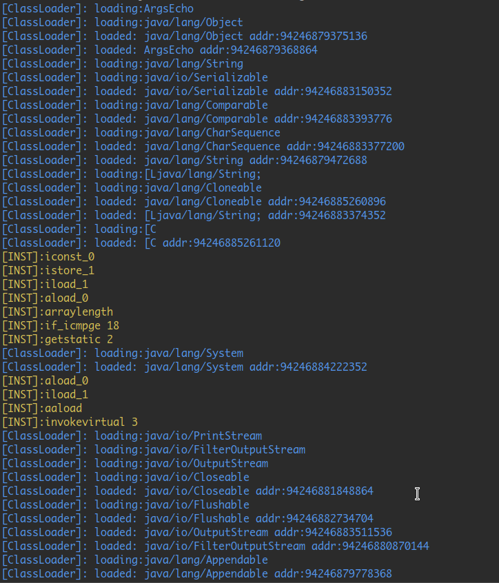

# JVM
this is a toy Java Virtual Machine implementation
 - support Java 8
 - support File Read && Write
 - support Exception handle

## Build
Require
 - linux/unix
 - C++17
 - libzip

```
cd path/to/JVM
mkdir build
cd build
cmake ..
make
```

## Run
running `./xjava` needs boot classpath contains a `rt.jar`, you need to specify boot classpath with `-Xbootclasspath <classpath>` if you don't have a `$JAVA_HOME` env for JDK8

## Full Usage
```
./xjava <options> [classname]
```
options: 
 - `-help`                        : show help
 - `-version`                     : show version
 - `-cp <classpath>`              : specify user classpath
 - `-Xbootclasspath <classpath>`  : specify boot classpath
 - `-verbose:class`               : show class loading detail
 - `-verbose:inst`                : show instruction excuting detail
 - `-dump <classname>`            : show classpy info, equivilent as `javap -verbose <classname>`

## TODO
 - support more native methods
 - support GC
 - support multithreading

## Screenshot
show class loading process and instructions excuting:



## Updates
 - 2020.4.25 add some native methods
 - 2022.5.01 support exception handle, file input & output