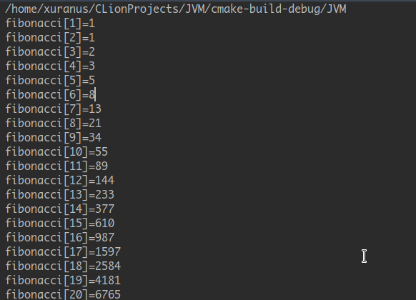

# JVM
this is a toy Java Virtual Machine implemented by C++

## Build
Require
 - linux
 - C++11
 - libzip

```
cd path/to/JVM
mkdir build
cd build
cmake ..
make
```

## Run
run `./JVM` requires a java runtime `rt.jar` which can be find in `lib/jre/lib/rt.jar`

move `jre` folder to excutable file root
```
cd /path/to/JVM/lib
mv jre ../build
```
and then run
```
./JVM [className]
./JVM -cp [userPath] [className]
```


## TODO
 - implement native
 - implement exception handler
 - implement annotation attribute
 - implement GC algorithm

## Screenshot
